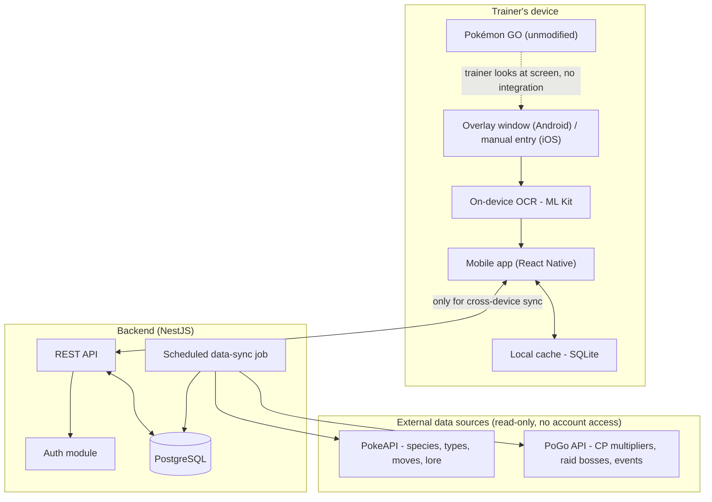

# Architecture

## System overview



## Current implementation status

| Component | Status | Notes |
|-----------|--------|-------|
| Mobile app (React Native) | ✅ Functional | Pokédex, IV calc, detail screen with lore |
| Bundled JSON data | ✅ Implemented | 965 species, PvPoke rankings, power-up costs, lore (Gen 1) |
| Backend (NestJS) | ✅ Functional | Species, Type Chart, PvP, Raids, and Companion AI (Gemini-backed) REST APIs (Swagger) + Prisma |
| Database (PostgreSQL + Prisma) | 🟡 Schema ready | Models defined; migrations not yet run |
| Overlay / OCR | ❌ Not started | Requires native Android Kotlin module |

## Mobile app architecture (Clean Architecture)

```
mobile/src/
  domain/           # Pure TypeScript, zero React Native dependencies
    iv-calculator/  # CP formula, HP formula, IV %, brute-force search
    pokemon-species/# Species type + bulk calculation
    pvp/            # Move name formatting, meta tier classification
    power-up/       # Candy/stardust cost calculation
    lore/           # Lore entry type definitions

  use-cases/        # Orchestration of domain logic
    filterPokedex.ts
    rankBulkPercentile.ts
    calculateIvsForSpecies.ts

  data/             # Repository implementations + static data
    pokedex/        # national-pokedex.json (965 species)
    pvp/            # pvp-rankings.json (PvPoke data)
    power-up/       # powerup-requirements.json (level costs)
    lore/           # lore-data.json (Gen 1) + fallback generator

  presentation/     # React Native components
    screens/        # PokedexListScreen, PokemonDetailScreen, IvCalculatorScreen
    navigation/     # RootNavigator (Stack), types
    theme/          # Colors, typography, spacing, shadows, Card, TypeBadge
```

## Data flow

```
Presentation (screens)
    ↓ calls
UseCases (orchestration)
    ↓ uses
Domain (pure functions — IV math, bulk calc, filtering)
    ↓ reads
Data (JSON file readers, API clients)
```

### Lore flow (specific)

```
PokemonDetailScreen
    ↓ getLoreWithFallback(species)
loreRepository.ts
    ├─ lore-data.json (hand-written, 151 species) → isAutoGenerated: false
    └─ Fallback generator (stats → text)          → isAutoGenerated: true
    ↓ LoreEntryWithFallback (8 fields)
PokemonDetailScreen renders lore card
```

## Key decisions

1. **No integration with the Pokémon GO client.** The only "input" from the game is what the
   trainer's eyes and camera/screenshot already see. This keeps the app outside Niantic's Terms of
   Service violations that target memory injection, automation, and credential-based scraping.

2. **Offline-first mobile app.** Calculators and cached Pokédex data work without network access;
   the backend is only required for cross-device sync (planned) and the optional Companion AI
   endpoint (`POST /api/companion/suggest`) — the one deliberate exception to offline-first,
   since it needs a live call to Gemini. Every other screen, including the in-app Companion
   widget's default lore/tips, works with zero network access. The app is fully free and open
   source — there is no paid tier and no billing.

3. **Backend as a cache refresher, not a live proxy.** The scheduled sync job pulls from PokéAPI /
   PoGo API on an interval and stores results in Postgres, so the mobile app never depends on
   those third-party services being up at request time.

4. **Clean Architecture layering** (see [coding-standards.md](coding-standards.md)) on both mobile
   and backend: domain logic (IV math, type effectiveness) has zero dependency on React Native
   components, NestJS decorators, or any specific data source — it's plain, testable TypeScript.

5. **Lore is written in-house, not scraped.** All trivia text is originally written by the team
   to avoid copyright issues. A fallback generator produces data-driven lore for species without
   hand-written entries (see [legal-compliance.md](legal-compliance.md)).

6. **Bundled JSON as initial data source.** The mobile app ships with static JSON files for the
   Pokédex, PvP rankings, and power-up costs. A future scheduled sync job (UC-06) will replace
   these with dynamically updated data from public APIs.

## Related flows

- [Overlay capture flow](flowcharts/overlay-flow.md) — screenshot to OCR to IV result
- [Partner Pokédex flow](flowcharts/pokedex-flow.md) — species detection to lore card
