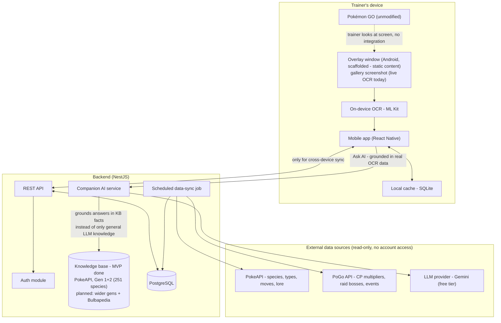

# Architecture

**The real-time AI overlay (bottom-right of the diagram: OCR → Companion AI → Knowledge Base) is
the project's flagship feature** — everything else here (Pokédex, calculators, backend REST API)
is the foundation it's built on. See "Key decisions" below and the README's "🏆 Flagship feature"
section.

## System overview



## Current implementation status

| Component | Status | Notes |
|-----------|--------|-------|
| Mobile app (React Native) | ✅ Functional | Pokédex, IV calc, detail screen with lore |
| Bundled JSON data | ✅ Implemented | 965 species, PvPoke rankings, power-up costs, lore (Gen 1) |
| Backend (NestJS) | ✅ Functional | Species, Type Chart, PvP, Raids, and Companion AI (Gemini-backed) REST APIs (Swagger) + Prisma |
| Database (PostgreSQL + Prisma) | 🟡 Schema ready | Models defined; migrations not yet run |
| **🏆 OCR pipeline (gallery screenshot)** | ✅ Functional | Species/CP/HP extraction → full analysis (IV, PvP, bulk, evolution, tips) |
| **🏆 Companion AI, grounded in real OCR data** | ✅ Functional | `POST /api/companion/suggest`, Gemini-backed, wired into "Ask AI ✨" |
| **🏆 Professor Mode — open-ended AI chat** | ✅ Functional | `POST /api/companion/chat`, multi-turn conversation via Gemini's native `contents` history, wired into `ProfessorChatScreen` |
| **🏆 Native floating window** | ✅ Scaffolding done | `OverlayModule.kt`/`OverlayPackage.kt` — permission + real `TYPE_APPLICATION_OVERLAY` window, verified surviving app backgrounding. Static placeholder content only |
| **🏆 Screen capture consent flow** | ✅ Scaffolding done | `MediaProjectionManager` consent dialog round-trips to JS via `ActivityEventListener`, verified on both accept and deny paths. No frame captured yet |
| **🏆 Native overlay live capture** | ❌ Not started | Needs a foreground service that opens the `MediaProjection` session the consent dialog already grants access to, and feeds captured frames into the existing OCR pipeline instead of a static label |
| **🏆 Knowledge base grounding the AI** | ✅ MVP done | `backend/src/data/knowledge/` — PokeAPI-sourced genus/habitat/Pokedex-entry facts for all 251 Gen 1+2 species (tracks the backend's species database range), folded into the Companion prompt. Next: wider generations + deeper (Bulbapedia-style) facts |

## Mobile app architecture (Clean Architecture)

```
mobile/src/
  domain/           # Pure TypeScript, zero React Native dependencies
    iv-calculator/  # CP formula, HP formula, IV %, brute-force search
    pokemon-species/# Species type + bulk calculation
    pvp/            # Move name formatting, meta tier classification
    power-up/       # Candy/stardust cost calculation
    lore/           # Lore entry type definitions

  use-cases/        # Orchestration of domain logic
    filterPokedex.ts
    rankBulkPercentile.ts
    calculateIvsForSpecies.ts

  data/             # Repository implementations + static data
    pokedex/        # national-pokedex.json (965 species)
    pvp/            # pvp-rankings.json (PvPoke data)
    power-up/       # powerup-requirements.json (level costs)
    lore/           # lore-data.json (Gen 1) + fallback generator

  presentation/     # React Native components
    screens/        # PokedexListScreen, PokemonDetailScreen, IvCalculatorScreen
    navigation/     # RootNavigator (Stack), types
    theme/          # Colors, typography, spacing, shadows, Card, TypeBadge
```

## Data flow

```
Presentation (screens)
    ↓ calls
UseCases (orchestration)
    ↓ uses
Domain (pure functions — IV math, bulk calc, filtering)
    ↓ reads
Data (JSON file readers, API clients)
```

### Lore flow (specific)

```
PokemonDetailScreen
    ↓ getLoreWithFallback(species)
loreRepository.ts
    ├─ lore-data.json (hand-written, 151 species) → isAutoGenerated: false
    └─ Fallback generator (stats → text)          → isAutoGenerated: true
    ↓ LoreEntryWithFallback (8 fields)
PokemonDetailScreen renders lore card
```

## Key decisions

0. **The real-time AI overlay is the product, not a bonus feature.** Every architectural choice
   below — on-device OCR, grounded prompting, backend-as-cache — exists to make the overlay
   reliable, fast, and legally safe. The calculators, Pokédex, and rankings are a genuinely useful
   app on their own, but they're the foundation the flagship feature sits on top of, not the other
   way around. The knowledge base grounding the AI's answers now has a working MVP (PokeAPI, Gen
   1); native always-on capture and extending the knowledge base further are the highest-priority
   remaining work in the project — see "Current implementation status" above.

1. **No integration with the Pokémon GO client.** The only "input" from the game is what the
   trainer's eyes and camera/screenshot already see. This keeps the app outside Niantic's Terms of
   Service violations that target memory injection, automation, and credential-based scraping.

2. **Offline-first mobile app.** Calculators and cached Pokédex data work without network access;
   the backend is only required for cross-device sync (planned) and the optional Companion AI
   endpoint (`POST /api/companion/suggest`) — the one deliberate exception to offline-first,
   since it needs a live call to Gemini. Every other screen, including the in-app Companion
   widget's default lore/tips, works with zero network access. The app is fully free and open
   source — there is no paid tier and no billing.

3. **Backend as a cache refresher, not a live proxy.** The scheduled sync job pulls from PokéAPI /
   PoGo API on an interval and stores results in Postgres, so the mobile app never depends on
   those third-party services being up at request time.

4. **Clean Architecture layering** (see [coding-standards.md](coding-standards.md)) on both mobile
   and backend: domain logic (IV math, type effectiveness) has zero dependency on React Native
   components, NestJS decorators, or any specific data source — it's plain, testable TypeScript.

5. **Lore is written in-house, not scraped.** All trivia text is originally written by the team
   to avoid copyright issues. A fallback generator produces data-driven lore for species without
   hand-written entries (see [legal-compliance.md](legal-compliance.md)).

6. **Bundled JSON as initial data source.** The mobile app ships with static JSON files for the
   Pokédex, PvP rankings, and power-up costs. A future scheduled sync job (UC-06) will replace
   these with dynamically updated data from public APIs.

## Related flows

- [Overlay capture flow](flowcharts/overlay-flow.md) — screenshot to OCR to IV result
- [Partner Pokédex flow](flowcharts/pokedex-flow.md) — species detection to lore card
