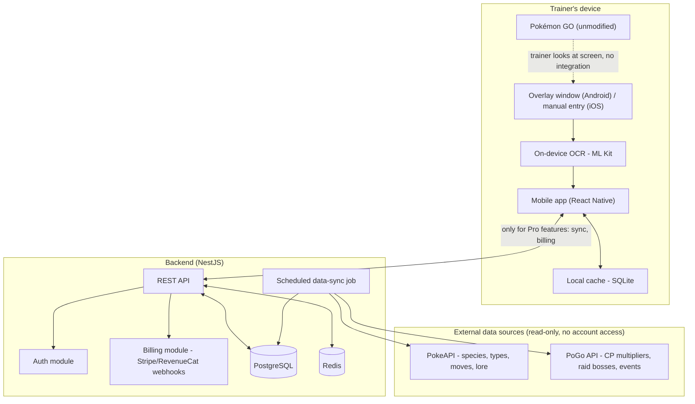

# Architecture

## System overview

## Key decisions

1. **No integration with the Pokémon GO client.** The only "input" from the game is what the
   trainer's eyes and camera/screenshot already see. This keeps the app outside Niantic's Terms of
   Service violations that target memory injection, automation, and credential-based scraping.
2. **Offline-first mobile app.** Calculators and cached Pokédex data work without network access;
   the backend is only required for Pro features (cross-device sync, billing).
3. **Backend as a cache refresher, not a live proxy.** The scheduled sync job pulls from PokéAPI /
   PoGo API on an interval and stores results in Postgres/Redis, so the mobile app never depends on
   those third-party services being up at request time.
4. **Clean Architecture layering** (see [coding-standards.md](coding-standards.md)) on both mobile
   and backend: domain logic (IV math, type effectiveness) has zero dependency on React Native
   components, NestJS decorators, or any specific data source — it's plain, testable TypeScript.

## Related flows

Step-by-step flowcharts for the two user-facing flows that drive this architecture live in their
own files, to keep this document focused on structure rather than sequencing:

- [Overlay capture flow](flowcharts/overlay-flow.md) — screenshot to OCR to IV result
- [Partner Pokédex flow](flowcharts/pokedex-flow.md) — species detection to lore card
