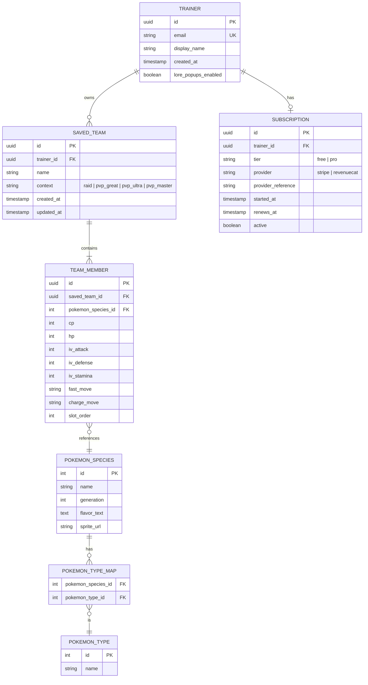

# Entity-Relationship Diagram

Covers only the entities that need a backend (accounts, saved teams, cached static data).
Calculators that don't require persistence (IV math, counter lookups) work entirely offline in
the mobile app and are not modeled here.

## Notes

- `POKEMON_SPECIES`, `POKEMON_TYPE`, and `POKEMON_TYPE_MAP` are a **read-only cache** populated by
  the sync job described in [use-cases.md](use-cases.md) (UC-06) from PokéAPI/PoGo API — the
  backend is the source of truth for the mobile app's local cache, not the other way around.
- `TRAINER` and `SAVED_TEAM` only exist for Pro accounts; a Trainer using the app without signing
  in never has a row here, which keeps the LGPD footprint minimal for the free tier
  (see [legal-compliance.md](legal-compliance.md)).
