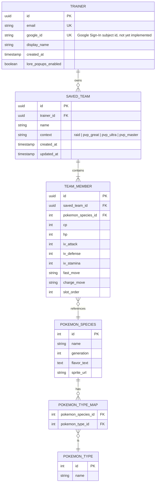

# Entity-Relationship Diagram

Covers only the entities that need a backend (accounts, saved teams, cached static data).
Calculators that don't require persistence (IV math, counter lookups) work entirely offline in
the mobile app and are not modeled here.

## Notes

- `POKEMON_SPECIES`, `POKEMON_TYPE`, and `POKEMON_TYPE_MAP` are a **read-only cache** populated by
  the sync job described in [use-cases.md](use-cases.md) (UC-06) from PokéAPI/PoGo API — the
  backend is the source of truth for the mobile app's local cache, not the other way around.
- `TRAINER` and `SAVED_TEAM` only exist for accounts that opt into cross-device sync; a Trainer
  using the app without signing in never has a row here, which keeps the LGPD footprint minimal
  (see [legal-compliance.md](legal-compliance.md)). The app itself is entirely free — signing in
  is only ever about syncing saved teams across devices, never about unlocking features.
- **Auth method decided, not yet implemented:** Google Sign-In (OAuth), not email/password — see
  [legal-compliance.md](legal-compliance.md) §3. `google_id` is the planned column for the OAuth
  subject identifier; `email` comes from the Google profile at sign-in rather than being
  collected/verified by this app directly. No endpoints exist yet — this is schema intent only.
- **Partially modeled:** the knowledge base grounding the flagship AI overlay's answers (see
  [architecture.md](architecture.md)) exists today as a *static bundled data file*
  (`backend/src/data/knowledge/knowledge-data.ts`, PokeAPI-sourced, 251 species), not a database
  table — it's read-only reference data checked into the repo, not per-trainer or dynamically
  updated, so it doesn't need a Postgres table yet. If it grows to need scheduled re-ingestion or
  runtime updates, a `KNOWLEDGE_ENTRY` table keyed by `pokemon_species_id` would be the natural
  next step — left out of this ERD until that's actually needed.
