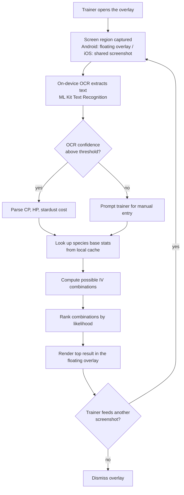

# Overlay Flow

Covers UC-01 (calculate IVs from a screenshot) from [../use-cases.md](../use-cases.md).

## Why OCR runs on-device

Sending the screenshot to a backend for OCR would mean transmitting and storing a frame of the
Pokémon GO client — unnecessary data handling, and it also removes the "never touches Niantic's
data" guarantee documented in [../legal-compliance.md](../legal-compliance.md). Running ML Kit
on-device keeps the screenshot local and keeps the backend out of the request path entirely for
this feature.
