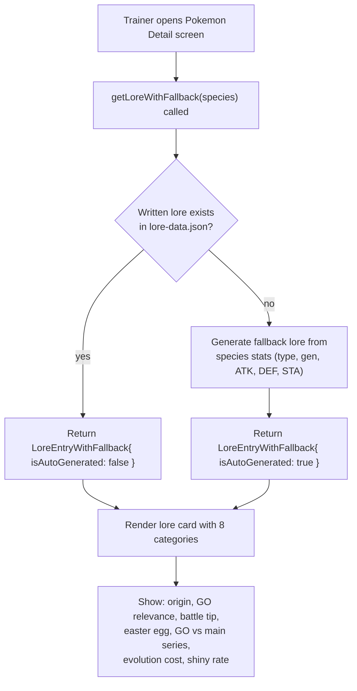
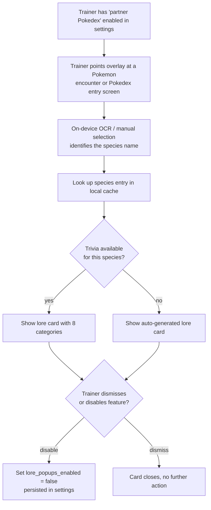

# Partner Pokédex Flow

Covers UC-04 (view partner Pokédex trivia) from [../use-cases.md](../use-cases.md).

## Mobile app flow (current implementation)

## Original overlay-based flow (planned)

## Lore data structure

Each species has 8 fields:

| Field | Description |
|-------|-------------|
| `origin` | Real-world inspiration, etymology, design influences |
| `goRelevance` | Spawn rate, raid usefulness, PvP ranking, event appearances |
| `battleTip` | Type weaknesses, recommended movesets, league viability |
| `easterEgg` | Cultural references, anime/movie trivia, fandom facts |
| `goDifference` | Mechanics that differ between Pokémon GO and main series games |
| `evolutionCost` | Candy and buddy distance requirements |
| `shinyRate` | Availability and approximate encounter rate |

## Design notes

- Lore text is written in-house, paraphrased from public knowledge rather than copied from game
  manuals or wikis (see [../legal-compliance.md](../legal-compliance.md), section 2).
- 151 Generation 1 species have hand-written lore; all other species use an auto-generated fallback
  based on their existing data (type, generation, base stats, evolution costs).
- The UI shows a small "auto-generated" label when fallback lore is used.
