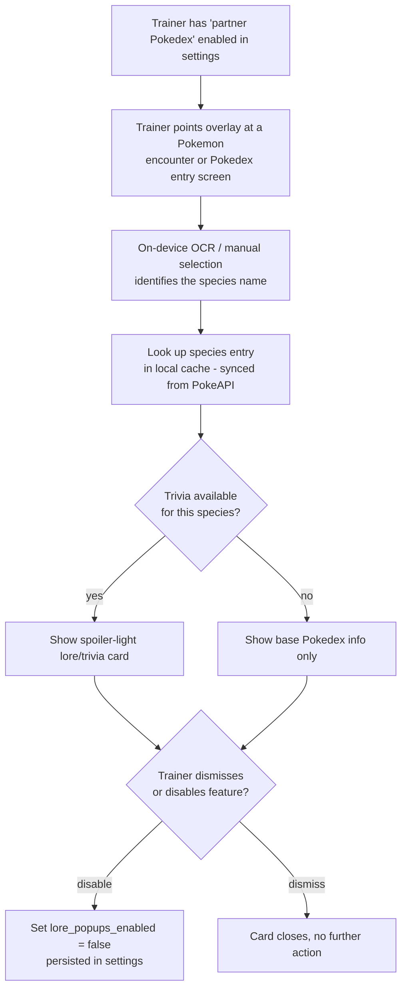

# Partner Pokédex Flow

Covers UC-04 (view partner Pokédex trivia) from [../use-cases.md](../use-cases.md).

## Design notes

- This feature is purely additive and reads only from the local Pokémon data cache (see UC-06) —
  it never depends on network access once the cache is populated.
- The toggle is a simple boolean stored in local settings (and, for signed-in Pro trainers, mirrored
  to the `lore_popups_enabled` column on `TRAINER` — see
  [../entity-relationship-diagram.md](../entity-relationship-diagram.md)) so the preference follows
  the trainer across devices.
- Trivia text is written in-house, paraphrased from public knowledge rather than copied from game
  manuals or wikis (see [../legal-compliance.md](../legal-compliance.md), section 2).
